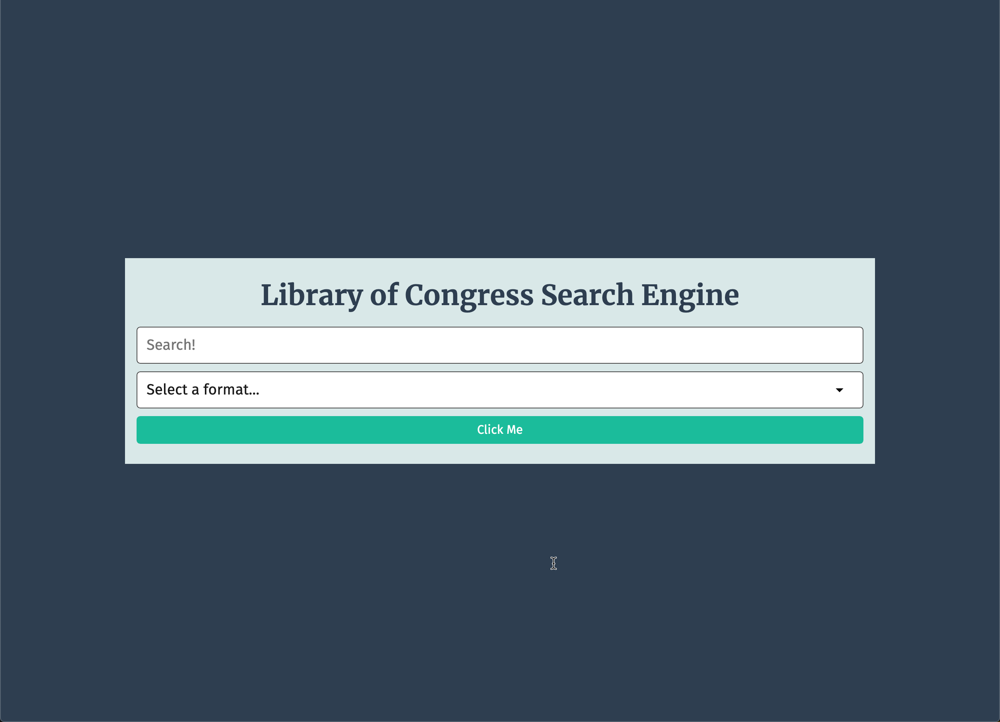

# Search-Tool

# Table of Contents
- [Search-Tool](#search-tool)
- [Table of Contents](#table-of-contents)
  - [GitHub Username](#github-username)
  - [Email](#email)
  - [Description:](#description)
  - [Usage](#usage)
  - [Built-With](#built-with)
  - [Licenses](#licenses)
  - [Deployed](#deployed)

## GitHub Username
[Mike Sowers](https://github.com/msowers72)

## Email
<msowers72@yahoo.com>

## Description:
This application searches and displays results from the Library of Conress API.

## Usage
As a user, I can submit a search query form the application to request data and receive a response from the Library of Congress.

## Built-With
* HTML
* CSS
* JavaScript
* Google-Fonts

   

## Licenses 

<!--  -->
  
 ## Deployed
 [Search-Tool](https://msowers72.github.io/Search-Tool/)
 
 
  
  
 

